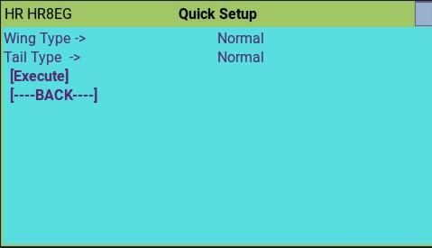
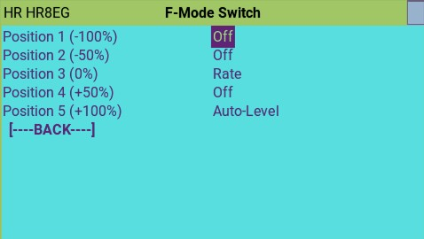
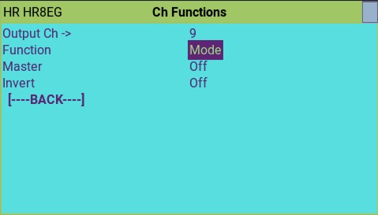
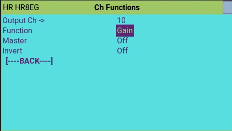
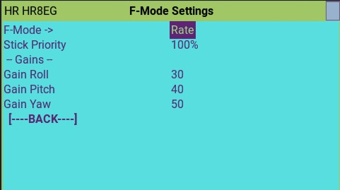
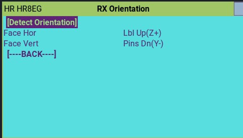
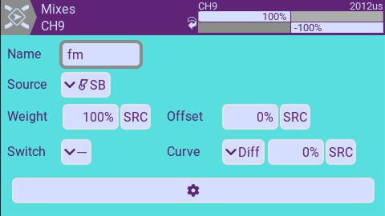
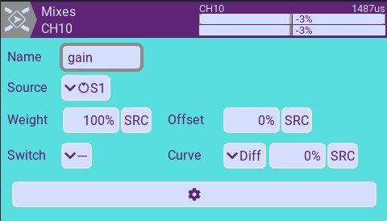

## HISTORY

This code is an adaptation of the original gyro code created by Alex Wigen [Original Code](https://github.com/awigen/ExpressLRS/tree/add-rx-gyro-support).
A lot of code has been changed from the original to make it easier to setup.  Some parts of code has been taking from other open source project, including Inav, OpenXSensor Gyro.  

I got some of the new RX with Gyro from Hello Radio Sky to play (Thanks Ken!). <b>This are prototype RXs.. not yet for sale!, but for developerts/testers</b>.

The idea is to have code that works out-of-the box for this receivers. THE HelloRadio Gyro RX are still not for Sale! What i got are prototypes.  

This code is the Official ELRS v4.0 + Gyro.

## Video

Created a video showing the configuration [VIDEO] (https://www.youtube.com/watch?v=Wk4s1B-1F_4)

## Gyro Support for HelloRadio HR7EG/HR8EG

This branch adds support for the internal gyro on HelloRadio Gyro Receivers.

## DISCLAIMER !!!!!

This is an experimental branch not ready for prime time. **Experiment at your own risk**.

## Feature list (Todo)
- [x] Quick Model Setup
  - [x] 1-Click setup of all the setting for the Gyro to work
  - [x] Wing-Type: Normal, 2-Ail, Delta
  - [x] Tail-Type: Normal, VTail, Taileron, Rudder-only
  - NOTE: Haven't flight tested Delta or Vtail.. so do your ground tests!

- [x] Model Setup
  - [x] Mode Switch Flight-mode Assigments
  - [x] LUA channel assignments  (what the channel is used for)
  
- [x] Gyro Settings
  - [x] Fight Mode parametes configurable per flight mode.
    - [x] Rate (Wind Rejection), Envelope (like Spektrum SAFE envelope), and Auto-Levl
    - [x] Gains for Roll,Pitch,Yaw
    - [x] Max angle Limits for Auto-Level and Envelope
    - [x] Angle Trims  for Auto-Level and Envelope
    - [x] Allow to use Rate together with other modes at the same time.

  - [x] Stick Calibration
    - [x] Simplified Gyro servo output Limits (center sticks, move sticks)
    - [x] Scale corrections according to channel limits, and gains

  - [x] Gyro Calibration
  - [x] Simplyfied Gyro RX Orientation (Set model level, then vertical)  

  - [x] LUA PID adjustment settings (Advanced)
  - NOTE: Only horizontal orientation right now, with any side face facing the front.  Need to fix this.

- [x] Multiple Flight Modes
  - [x] Gyro mode: Rate (Gyro Wind correction on)
  - [x] Gyro mode: Envelope  (Max Angle Envelope)
  - [x] Gyro mode: Auto-Level (Auto-Level + Max angle Envelope)
  - [x] Gyro mode: Launch (Level + pitch up)
  - [ ] Gyro mode: Hover (NOT READY)

- [ ] Stick Priority for VTail/Delta
    currently if will use the Elevon channel for both Roll/Pitch, and Vtail for Pitch/Yaw.  Somehow Specktrum can separate them properly, even the radio send then together. So there is a way! Probably analizing when both move together is Pitch, and separate are Roll/Yaw. 
 

## Setup

**IMPORTANT: Use the ELRS.lua from this branch, since the gyro use multiple nested level of menus** it will show in the screen as (r17-gyro). Additionally, when you navigate to a sub-menu, the title will show in the middle. Even with that, only the current screen refreshes with changes.. not the other screens. Sometimes is better to just restart the LUA to get the most recent values.

The gyro settings are available through the
[ExpressLRS Lua script](https://www.expresslrs.org/quick-start/transmitters/lua-howto/).

### Finding the settings menus

1. First launch the ExpressLRS Lua script.
1. Go to "Other Devices".
1. Select your receiver.
1. If your receiver is correctly flashed you will see gyro menu items. 
1. If you are using the elrs.lua from this branch, you will see the sub-menu title when navigating into another sub-menu.

### Gyro Menu

By default, the Gyro will be OFF. This RX will work normally without Gyro functionality.
On the status, it shows:
  * the Gyro software version
  * the storage configuration version (important for developers to do automatic upgrades of gyro configuration for future versions)
  * IMU/MPU detected: MPU6050 or LSM6Dxx are supported

The faster way to get things up and running is to:

1. Quick-Setup:  Go to Model-Setup -> Quick Setup to define your plane. This will reset the RX to factory defaults and setup the type of plane you choose.  NOTE: Restart the LUA script.
1. Turn the Gyro ON in the main gyro page.
1. Go to Gyro-Setting: Perform Gyro Calibration, Perform RX orientation

### Quick Model Setup

### Quick Setup

In here, you can setup your RX/Gyro really quickly.   Select your wing-type and tail-type, then execute.   This will setup complely the model part of the gyro. It will do:

1. Configure All options of the gyro to the default Factory settings.
1. Configure Ch Functions for the specified plane.
1. Configure flight-mode switch on Ch9 to have a 3-pos switch:  Off, Rate, Level
1. Configure Master gain on Ch10.
1. The only thing missing will be to turn the Gyro ON, do calibration, and validate that the gyro moves the surfaces correctly

<b>NOTE: Current LUA only refreshes the current page. All other pages will have the previous values.  Since Quick-Setup changes every setting in the RX, please restart the LUA script to make sure all the values/screens are refreshed.</b> 

####  F=Mode Switch Settings

Here you can select what flight mode do you want on each position of the switch. A tipical 3-pos switch will have -100,0,+100.

If you want all 5 positions, set channel mode with a 3-pos switch to a weight of 50%.. That will give you -50,0,+50.  Use a special function to activate the -100 or +100.   

For example, set -50=Off, 0=Rate, +50=Envelpe, +100=Auto-level. Your 3-pos withc will take care of the first 3.  To active Auto-Level (panic), create a special function on another switch (ex. SH) to override the mode to +100.. now you have 4 modes.

 

### Model Setup: CH Functions

In the "Ch Functions" menu you can setup what is the functionality for each channel.

The gyro functions are:

* Aileron output
* Elevator output
* Rudder output
* Elevon output  (Elevator + Aileron Mix: Left and Right)
* V-Tail output  (Elevator + Rudder Mix: Left and Right)
* Gain - Gain Mode Channel
* Mode - Flight Mode Switch

IMPORTANT:
The gyro needs to know who is the master for (Roll, Pitch, Yaw) in the case that you have multiple surfaces of the same type.  The one maked "master" will be the one that the Gyro will use for monitoring the stick movement.

For each channel you can setup gyro output inversion. A typical setup is having
two aileron servos where one of the output channels needs to be reversed.

For Elevon/Vtail,  first make the Elevator to work on the right direction, then use the Left/Right (exanmple VTail_L or VTail_R) option to invert the secondary function (Ail or Rud).

Also you need to assign a channel for Gyro "Mode" selection switch and "Gain", the master gain channel.

###  Model Setup: Gyro Modes

A input channel configured for "Mode" in the "Gyro Inputs" menu can be used to
select the active stabilization mode.

#### Rate Mode

Also called wind-regection mode.. it will try to correct quick rotational movements of the plane. The gyro will quckly react and go back to center.

* Stick Priority: It is a variable gain depending on the stick deflection. At what point on the stick deflection the gyro has no action.  At stick center, gyro has 100% gain of movement and start declining as you move the stick outwards. At stick 1/2 movement outwards the gyro has 50% gain of movement, and at full deflection 0% gain.    When set to 100% (Full delection) is when gyro reach 0 gain, When set at 50% (50% deflection), the gyro reach 0 at 1/2 stick deflection.

* Gains:  This are the Gains for each axis.. higher value makes the gyro moves more the surfaces for that axis.

#### Level Mode   (Angle Demand)

In this mode the gyro will work to keep the plane flying level when the sticks are centered.  It also will not let you bank/pitch past the Angle Limits.

If you move the stick 1/2 way to the side, the plane will not bank/pitch more than 1/2 of the Max Angles. Example: if your Limit Roll is 70 and your stick is 1/2 way out, the plane will fly at 35 deg bank angle.  For this reason, this mode is also called "Angle Demand".

* Use Rate: it will combine the gyro "Rate" functionalty here for wind regection.  

* Limit Pitch/Roll: Maximun angles.. Will not let you pass that angles

* Gains: How stong the gyro should try to return the plane to level.
  35 is a good start for soft movement, increase the gains to make it go back to level faster when releasing the sticks.

#### Envelope Mode (Max Angle Envelope protection)

In this mode the gyro will work to limit pitch and roll angles within the configured limits.

Once you reach the Max angle, the gyro will not allow to go any further.. you need to move the stick to center and oposite direction to go back to normal.

* Use Rate: it will combine the gyro "Rate" functionalty here. Otherwise it will be like "Rate" OFF, and gyro only activates when max angles are reached.

* Limit Pitch/Roll: Maximun angles.. Will not let you pass that angles

* Gains: How stong the gyro should try to keep you at that max angles.
  35 is a good start for soft movement.

#### Hover Mode

NOT TESTED
In this mode the gyro will add corrections to elevator and rudder channels in
order to keep aircraft pointing directly upwards.

#### Calibration

1. RX orientation.. You will set the plane level (learn level trim), and the set the plane with the nose up to learn what is the front of the plane.  It will tell you what Face of the RX is facing up when is on the Horizontal or Verital postion.  if it says "WRONG", i have not detected the positions.

1. Gyro Level Calibration: The RX orientation already did the Level calibration in its first step.  But it you only want to calibrate level only, you can run it again.

1. Stick Calibration is to learn the center and max travel of Ail, Ele and Rud.  

### PID (Very advanced)

NOTE: Dont't touch it unless you know what you are doing, and know how to configure the PIDs and its meaning.

* PID-GROUP:   PID for Rate, and PID for Level/Envelpe/Hold
* PID-Axis: Axis to configure (Roll, Pitch, Yaw)
* P,I,D values:  NOTE: very carefull with I.

## How is my plane configured in EdgeTX

1. Setup your plane as you need
1. Add Ch9 to be your Flight mode Switch
1. Add Ch10 to be your Gain (Variable Gain, using my S1 on the TX16),
You only want variable gain while you setup the Rate/Gyro-ON, after that, you want to set it to fixed this way.
Once you find the right setting, Note on the top of your Ch10 where it is (+65% for example). Then change it to "source" MAX, and change the "weight" to 65%.  The output should refrect the same as you started. Later on, you can have multiple settings depending on your flight mode , switch, or Thr (See how the Two-Brothers RC videos..High gains on the landings controlled by Thr via a curve and delays)  

## Hello Radio Sky Hardware

NOTE: Prototypes for Developers.. not yet for sale!

## DIY Hardware

External boards for some gyros are easilly available, and can be connected to the I2C bus.

* MPU-6050 : Very common, and supports 5V.
* LSM6DSO IMU: Not that common, but trying to support the family of LSM6Dxx. Not that friendly since it only supports 3V, and will need a regulator.

Example: BetaFPV SuperP receiver with an external MPU-6050 I2C module. 

